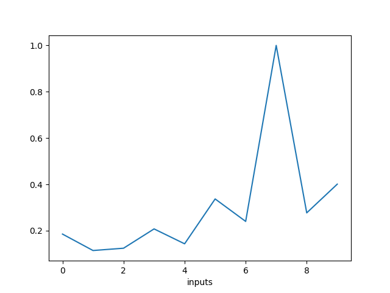
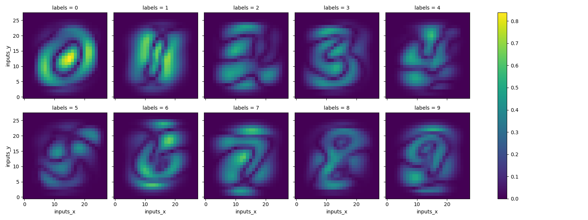
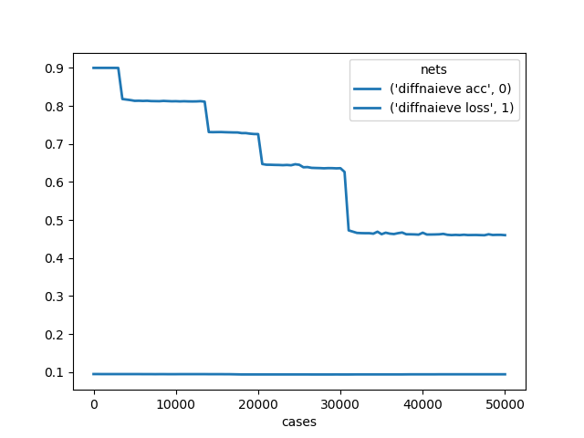
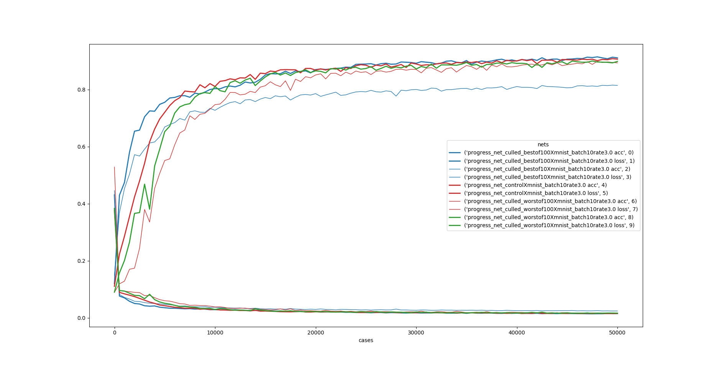

Using activation probabilities to choose initial parameters
===========================================================
One of my questions is: what pattern, or meaning, is represented by the output of each
individual neuron in a neural network? For the last layer of a network trained with
backpropagation, the answer is simple: each neuron represents the expected values it
has been trained with. In my MNIST network for example, the neuron representing the digit
"7" will output towards 1.0 when the input data is labelled "7", and towards 0.0 for
everything else.

My hypothesis is that we should find such biases in the activations of every neuron,
and those biases should be more distinct when the inputs include the patterns that
neuron detects. Therefore, we might be able to use a neuron's activations to recover
features of the input dataset, in effect finding a vector embedding of those features
in the intermediate outputs of a network.


Activation probability distributions
------------------------------------

One way of detecting such biases is to make a histogram of a neuron's outputs:
a non-parametric probability distribution of the activations. Let's train a simple neural
network with 1 hidden layer of 30 neurons on the MNIST dataset, and generate histograms
for its output neurons:

```python
import numpy as np, xarray as xr, matplotlib.pyplot as plt
from littlenet import apd, utility, neural_net as nn, train

net = nn.NeuralNet((784, 30, 10))
utility.write_object(net, 'rand_net', directory='./models/init-apd')
# always write to file to avoid re-generating and re-training networks

rand_net = utility.read_object('./models/init-apd/rand_net.pyc')
train_inputs, train_labels, test_inputs, test_labels = utility.training_and_test_inputs(is_onehot=False)
train_onehot = utility.make_onehot(train_labels, range(10))
test_onehot = utility.make_onehot(test_labels, range(10))
trained_net, progress = train.train_nn(net, train_inputs, train_onehot, test_inputs, test_onehot,
                                       sample_rate=500, hyperparams={'batch': 10, 'rate': 3.0})
train.write_nn(trained_net, progress, name='rand_net', save_dir='./models/init-apd')

trained_net = utility.read_object('./models/init-apd/trained_rand_net.pyc')
progress = utility.read_object('./models/init-apd/progress_rand_net.pyc')

activations = trained_net.pass_forward(train_inputs)
# activations for the output layer only, for all the training data
output_layer_apds = apd.apd_raw(activations[nn.mkey(2, nn.KEY_OUT_POST)], num_buckets=20)
histograms_all = apd.merge_ex(output_layer_apds, nn.DIM_IN)
histograms_all.plot(x=apd.DIM_HIST, col=nn.DIM_IN, col_wrap=5)
plt.show()
```


As expected, the majority of the output values are clustered near 0, with about 10% of the values
near 1.0. What about for a single label, such as "7"?

```python
histogram_7 = apd.subset(output_layer_apds, **{nn.DIM_CASE: np.equal(train_labels, 7)})
histogram_7.plot(x=apd.DIM_HIST, col=nn.DIM_IN, col_wrap=5)
plt.show()
```


Here the neuron representing "7" clearly outputs around 1.0, while all other neurons remain near 0.0.

Now, we want a way to find out where and when the activation probability distributions vary for a
given neuron. One way is to find the absolute difference between the two distributions:

```python
abs_diff_per_neuron = apd.apd_area(apd.diff(histogram_7, histograms_all))
abs_diff_per_neuron.plot(x=nn.DIM_IN)
plt.show()
```



In the chart above, the areas of each histogram have been summed to make them easier to compare. The
activation for the neuron representing "7" clearly shows a spike in difference compared to the other
neurons. This makes sense, since we are comparing the activations of all the test data versus the data
containing only "7"s. The activations of the neuron representing "7" have jumped from near 0. to near 1.0,
giving it the largest difference, whereas the activations of the other neurons remain near 0.

Plotting the activation differences for the input layer creates an interesting picture, showing
which pixels are varying the most for each digit:

```python
diff_per_input = apd.apd_area(apd.diff_by_label(train_inputs, train_labels))
utility.write_object(diff_per_input, 'apd_diff_by_labels', directory = './models/init-apd')

diff_per_input = utility.read_object('./models/init-apd/apd_diff_by_labels.pyc')

# y-axis is reversed when plotting, flip image to make digits more obvious
plot_diffs = utility.flip_images(diff_per_input, dim=nn.DIM_Y).unstack(nn.DIM_IN)
plot_diffs.plot(x=nn.DIM_X, y=nn.DIM_Y, col=nn.DIM_LABEL, col_wrap=5)
plt.show()
```




Choosing initial parameters and training networks
-------------------------------------------------

Starting with a naive approach, let's simply use the activation probability difference at the input layer as
weights for a neural network.

```python
net_diffnaive = nn.NeuralNet((784, 10), func_fill = np.zeros)
net_diffnaive.matrices[nn.mkey(0, 'weights')] = diff_per_input.rename({nn.DIM_LABEL: nn.DIM_OUT}) \
    .transpose(nn.DIM_IN, nn.DIM_OUT).reset_index(nn.DIM_IN, drop = True)
trained_net_diffnaive, progress_net_diffnaive = train.train_nn(net_diffnaive, train_inputs, train_onehot, test_inputs, test_onehot,
                                       sample_rate=500, hyperparams={'batch': 10, 'rate': 3.0})
train.write_nn(trained_net_diffnaive, progress_net_diffnaive, name='net_diffnaive', save_dir='./models/init-apd')

trained_net_diffnaive = utility.read_object('./models/init-apd/trained_net_diffnaive.pyc')
progress_net_diffnaive = utility.read_object('./models/init-apd/progress_net_diffnaive.pyc')
train.plot_progress([('diffnaive', progress_net_diffnaive)])
```



The result is terrible. This is probably because we have not accounted for whether the difference for
each pixel tends towards being positive or negative. We would probably also get better results with
an additional intermediate layer, but we'll leave further experiments in this direction for another time.

Instead of initializing parameters directly, we can use the activation probabilities to evaluate
randomly generated neuron weights. First, we find the activation probability difference between
each label and the dataset. Then, we sum up the resulting difference areas with a cost function.
We can then choose the neurons with the highest costs as the best, since they show the most variance
for the labels we want to train the neural net to recognize, and neurons with the lowest costs
as the worst. Randomly chosen neurons are our control sample.

The actual code to do this is quite lengthy, so I've put it in the apd.py module:

```python
# num_to_search is the number of candidates considered per neuron, so more candidates should cause more extreme performance
net_culled_bestof10, net_control, net_culled_worstof10 = apd.build_culled_net_from_random(train_inputs, train_labels, num_to_search=10)
net_culled_bestof100, _, net_culled_worstof100 = apd.build_culled_net_from_random(train_inputs, train_labels, num_to_search = 100)
utility.write_object(net_culled_bestof100, 'net_culled_bestof100', directory='./models/init-apd')
utility.write_object(net_culled_bestof10, 'net_culled_bestof10', directory='./models/init-apd')
utility.write_object(net_control, 'net_control', directory='./models/init-apd')
utility.write_object(net_culled_worstof10, 'net_culled_worstof10', directory='./models/init-apd')
utility.write_object(net_culled_worstof100, 'net_culled_worstof100', directory = './models/init-apd')

culled_nets = utility.read_all_objects('./models/init-apd', pattern = 'net_c*')
trained_nets, progress = train.train_all(culled_nets,
                [('mnist', train_inputs, train_onehot)], [{'batch':10, 'rate':3.0}],
                test_inputs, test_onehot, sample_rate=500, save_dir='./models/init-apd')
progress_culled_best = utility.read_all_objects('./models/init-apd', pattern = 'progress*best*')
progress_control = utility.read_all_objects('./models/init-apd', pattern = 'progress*control*')
progress_culled_worst = utility.read_all_objects('./models/init-apd', pattern = 'progress*worst*')
train.plot_progress(progress_culled_best, progress_control, progress_culled_worst)
```



This shows a more promising trend: the best nets seem to perform better at the start of training.
However, the networks seem to perform similarly by the end of training, and the trend is pretty
small and easily swamped by random variation.

Future experiments can include running multiple trials to see how much random variation
affects training progress, and more sophisticated ways of using the activation probabilities
to initialize network parameters. We can also try to manipulate trained networks using their
activation distributions.
