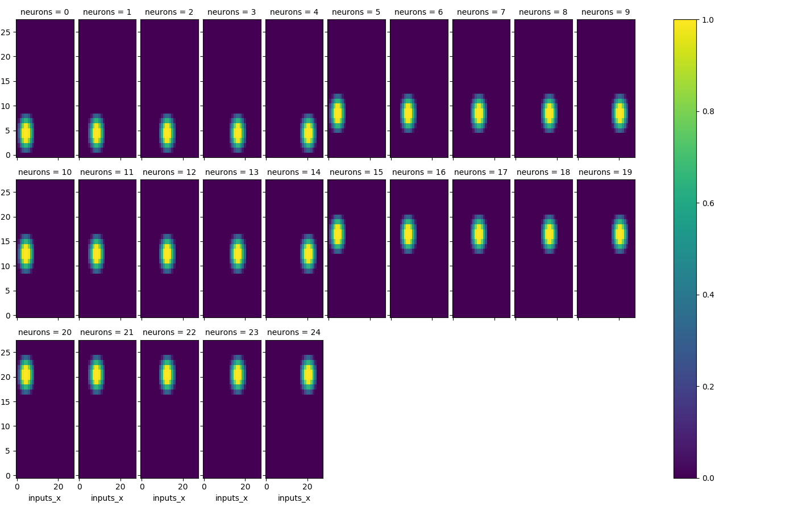
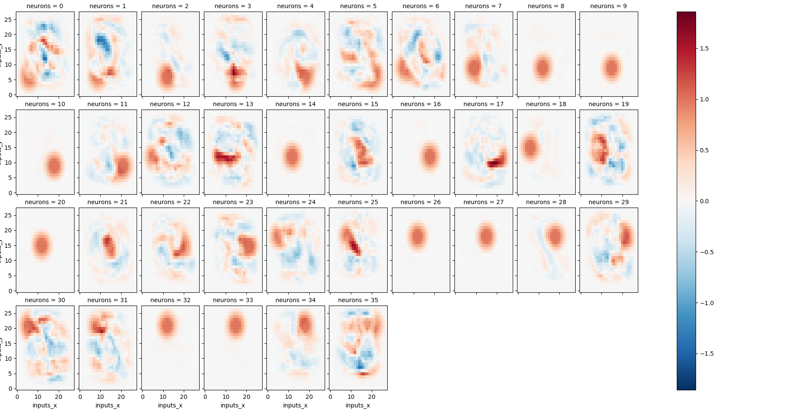
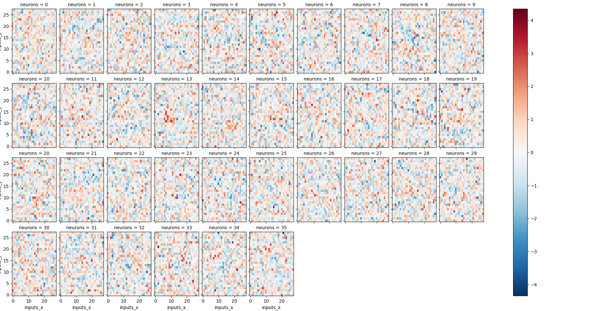
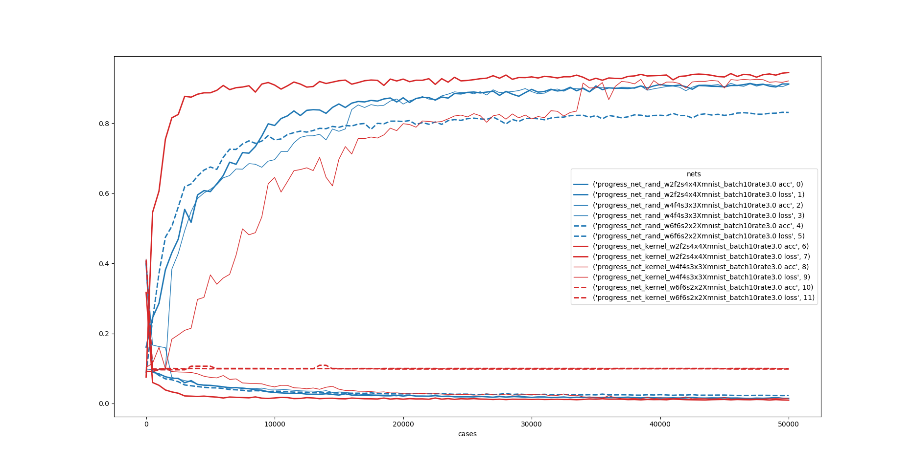

Manually designing initial parameters
=====================================

Neural networks fluctuate in performance to some extent depending on
their initial parameters. Thus we can hypothesize that carefully selected
initial parameters might improve the quality of the trained network.

Note that I am not using convolutional networks or deep networks with multiple layers.
This is for a few reasons: first, I want to keep the experiments simple and reduce
the number of variables. Second, I am looking for fundamental ways in which to improve
neural network training without relying on assumptions. For example, convolutional
networks assume that information is correlated by proximity in the input space.
I am interested in finding methods to deduce these kinds of correlations from the
input data itself, without making explicit assumptions.

In this experiment, I wanted to see if human-chosen initial parameters
can outperform randomly generated ones. Since the MNIST dataset is image-based,
let's make a set of neurons that have weights in the shape of a dot, like a set
of convolutional kernels. We also randomly initialize networks with the same
layer sizes as a control:

```
import numpy as np, xarray as xr, matplotlib.pyplot as plt
from littlenet import apd, utility, neural_net as nn, train

kernel_nets = [*utility.build_kernel_net(6, 6, (2, 2)),
               *utility.build_kernel_net(4, 4, (3, 3)),
               *utility.build_kernel_net(2, 2, (4, 4)),]
```

The network's first layer weights look like this for the kernel and control nets:

```
utility.plot_first_layers(kernel_nets)
```




Now we train all of the generated networks:

```
kernel_nets = utility.read_all_objects('./models/kernel', pattern='net_*')
inputs, labels, test_inputs, test_labels = utility.training_and_test_inputs()

trained_nets, progress = train.train_all(kernel_nets,
                [('mnist', inputs, labels)], [{'batch':10, 'rate':3.0}],
                test_inputs, test_labels, sample_rate=500, save_dir='./models/kernel')
```

The trained weights for each net are clearly different.

```
trained_nets = utility.read_all_objects('./models/kernel', pattern='trained_*')
utility.plot_first_layers(trained_nets)
```





However, when plotting each network's accuracy and loss progress...

```
progress_rand = utility.read_all_objects('./models/kernel', pattern='progress*rand*')
progress_kernel = utility.read_all_objects('./models/kernel', pattern='progress*kernel*')
train.plot_progress(progress_rand, progress_kernel)
```




The results aren't great. Interestingly, the smallest kernels perform better, whereas the largest
kernel fails to train. The shape and size of the kernels is clearly critical for capturing
meaningful distinctions in the data. It is also possible that the bias is too far off for the larger
kernels - the sigmoid activation function has a flat slope away from x=0, and since the kernel
only has positive weights the neuron emits a high value, resulting in a low gradient.

Future experiments could play with the kernel sizes and spacing, or offset the excess of positive
weights with an appropriate bias.
